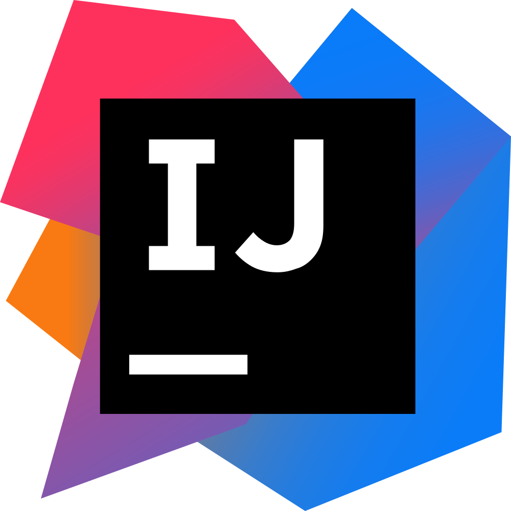

### Hi there, I'm Philipp 👋

### I'm a passionate software developer

<!-- - 🔭 I’m currently working on ... -->
- 🌱 I’m currently learning everything
<!-- - 👯 I’m looking to collaborate on ... -->
<!-- - 🤔 I’m looking for help with ... -->
<!-- - 💬 Ask me about ... -->
- 📫 How to reach me: ph.schaefer@protonmail.com
<!-- - 😄 Pronouns: ... -->
- ⚡ Fun fact: I love geocaching and listening to country music
 

### Languages and Tools:

